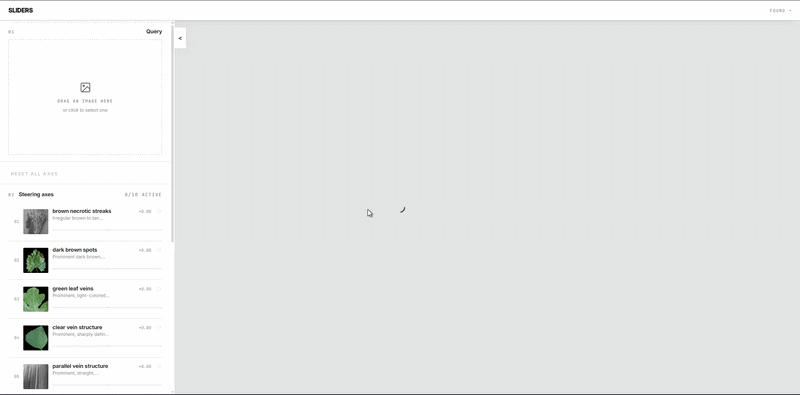
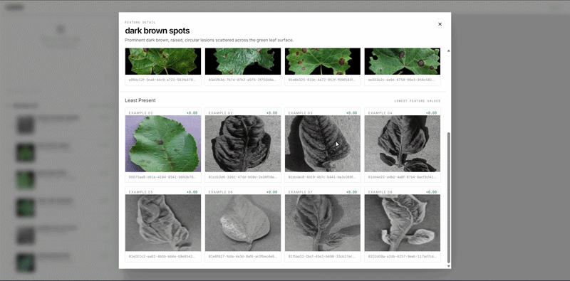
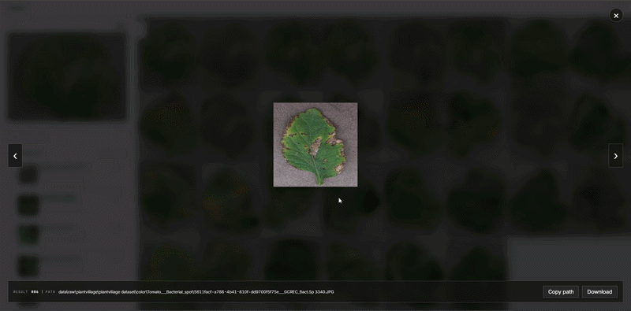

# SLIDERS

Semantic visual search with interpretable steering axes. Upload an image, drag sliders to push results toward or away from visual concepts the model has learned. Each axis is named automatically by a local VLM.

---

*Drop a query image; the left panel shows learned visual axes you can drag.*

---

*Click any axis to inspect which images activate it most and least.*

---

*Click any result to open full resolution, copy its path, or download it.*

---

## References

- [SLIDERS dataset](docs/media/SLIDERS_dataset.pdf)
- [Related papers](docs/media/references.html)

## Documentation

| Page | Content |
| --- | --- |
| [docs/GUIDE.md](docs/GUIDE.md) | Setup and full run guide |
| [docs/ARCHITECTURE.md](docs/ARCHITECTURE.md) | Runtime flow and module layout |
| [docs/CONFIGURATION.md](docs/CONFIGURATION.md) | All YAML config options |
| [docs/TROUBLESHOOTING.md](docs/TROUBLESHOOTING.md) | Known failure modes and fixes |
